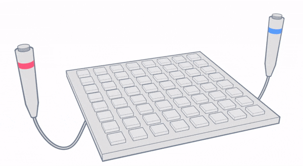
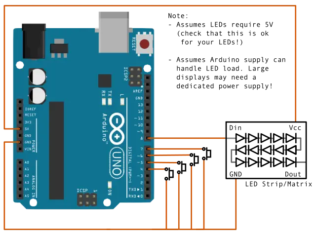
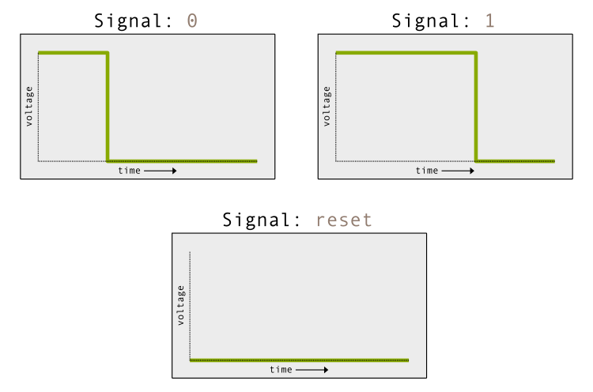
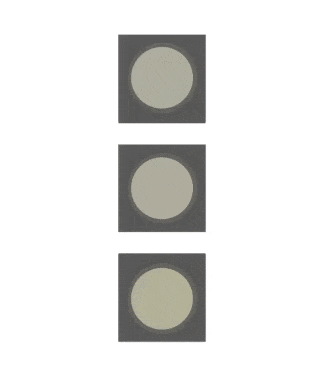
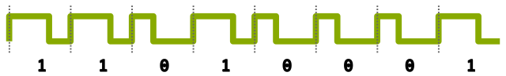

# Jeopardy Buttons (Arduino)

This repo contains code for implementing a [Jeopardy](https://www.jeopardy.com/)-like question answering device using an Arduino (or similar microcontroller). This was made for a friend looking for a way to decide 'who answered first' when playing family games at home.

  

## Basic idea

The code for this project is contained in the `jeopardy_buttons.ino` file. The basic idea is to repeatedly loop over every button and read for button presses. Once a button is pressed, the LEDs are lit up with a color corresponding to the pin associated with the button. During this time, other button presses are ignored. The LEDs will stay solidly lit for a period of time (controlled by the `ANSWER_TIME_MS` variable at the top of the file) before turning off, at which point button-reading resumes.

The code assumes 4 players by default, but this can be changed by simply adding/removing pin numbers to the variable `BTN_PIN_NUMBERS` near the top of the script. Also note that if more players are added, then additional colors need to be added to the variable `BTN_COLORS` (which are encoded as `{red, green, blue}` values, see the code for examples).

### Extra complexity

In theory, the code for repeatedly reading over buttons and lighting up corresponding LEDs should be fairly simple. However, looking through the actual code, it may seem much more complicated than expected! The added complexity comes from two sources. For one, there is some work done to *animate* the LEDs when they turn off, to help give some sense of a timer running out. The second source of complexity comes from doing some additional checks to prevent players from being able to hold down their button to answer after another player's timer runs out. For example, imagine one player is answering but gets the wrong answer, leaving other players to jump in. If every player were to hold down their button, then whoever has the button that appears first in the simple reading loop would always get to answer first, without having to race/time their press to beat out other players. This seems unfair and also removes the fun of players frantically pressing their button to answer, so the code constantly checks that the buttons haven't been pushed recently when deciding whether to trigger the LEDs.

## LEDs

By default, the code assumes there are 16 LEDs. If you're using more/less LEDs, you can update the variable `NUM_LEDS` to the appropriate value. For example, if you use an 8x8 LED matrix, then you would want to change `NUM_LEDS` to 64. Nothing bad will happen if this number doesn't match the number of LEDs you have, it will just alter the animations (and potentially not use all of your LEDs).

The addressable RGB LEDs are controlled using the [Adafruit](https://www.adafruit.com/) NeoPixel library, though this library is *not* included in this repo. Luckily, the library can be easily installed through the Arduino IDE using the instructions found on the [NeoPixel Github page](https://github.com/adafruit/Adafruit_NeoPixel).

Although the NeoPixel library is used to drive the LEDs, the code will work with other (non-Adafruit) products. For example, while getting things working, I used a 16x16 LED matrix from the company [BTF-Lighting](https://www.btf-lighting.com/), which I got off Amazon. If you have similar LEDs but are worried about compatibility, you can check for references to the product code `WS2812B` (or maybe `SK6812`, since the documentation seems similar), since any LED strips using these LEDs should work.

## Circuit

The circuit for this project is simple. Internal [pull-up resistors](https://docs.arduino.cc/tutorials/generic/digital-input-pullup) are used on each of the button inputs, so aside from the buttons themselves, no additional components (e.g. resistors) are needed. Similarly, all of the control/power delivery circuitry of the addressable LEDs is fully self-contained. The diagram below shows how to wire everything up to an Arduino, the pins shown below correspond to the settings in the code, but these can be modified if needed (including adding more buttons):

  

The LEDs are shown as being powered by the Arduino 5V pin. As noted in the diagram, this is fine as long as your LEDs are rated for 5V, so be sure to double check this! Likewise, if you're using a large LED matrix or very long strip, you may need a separate dedicated power supply to power them, since the Arduino output is only rated for a few hundred milliamps. For reference, I used a 16x16 (256) LED matrix and was able to power it directly off the Arduino, but this is likely nearing it's limits!

## Note on LED signaling

The Adafruit NeoPixel library takes care of driving the LEDs, so the information in this section is only for people who might be interested in understanding the signaling and/or looking to avoid the use of the NeoPixel library (not that it's bad, but maybe you want to have all the code in a single file for example). It's also just a neat signaling system to learn about!

The signaling scheme that the LEDs use is referred to as 'unipolar non-return-to-zero' ([NRZ](https://en.wikipedia.org/wiki/Non-return-to-zero)). The Adafruit site has two documents, one for [WS2812B](https://cdn-shop.adafruit.com/datasheets/WS2812B.pdf) and the other for [SK6812](https://cdn-shop.adafruit.com/product-files/1138/SK6812+LED+datasheet+.pdf), which explain how the signaling works. Though a bit odd, this approach to signaling is useful because it gives 'addressable' LEDs using only a single pin! The downside is that the LEDs must be addressed 'in sequence', meaning you can't update a specific LED without updating the state of every LED connected before it.

The signaling is basically a semi-analog system transmitted over digital signals, where there are 3 instructions: `0`, `1`, `reset` as well as a mechanism to ignore the `0` and `1` instructions.
The three instructions (`0`, `1` and `reset`) are encoded using different [PWM](https://en.wikipedia.org/wiki/Pulse-width_modulation)-like signals, where the duty-cycle encodes the intended instruction. For example, `0` is represented using a ~32% duty-cycle while `1` uses a ~64% duty-cycle (assuming I'm interpretting the documentation correctly!). The `reset` signal is sort of like a 0% duty-cycle, but it must be maintained for a much longer period of time compared to the other signals (50us vs 1.2us).

  

Once an LED has received instructions to fully specify it's RGB state (which is 8 bits for each of the red, green and blue components, so 24 bits total), then it will ignore any `0` or `1` that gets sent until it receives a `reset` signal. The bits that it ignores are passed along to it's output which can be connected to other LEDs in sequence to drive them. This is how the LEDs appear to be 'addressable', since the first 24 bits will set the state of the first RGB LED, the next 24 bits set the 2nd LED etc. This also means that in order to change a single LED without affecting any others before it, you would first need to send a `reset` signal (i.e. send nothing for a while) and then re-send a duplicate set of bits that match the previous state for each LED before sending an updated set for the one LED you want to change. Note that the `reset` signal doesn't turn off the LEDs (they maintain their existing state), it just prevents them from ignoring instructions.

  

Both the `0` and `1` signal start off in a 5V (high) state and transistion to 0V (low), so a continuous sequence of these signals will maintain a constant frequency, with each *rising-edge* indicating the beginning of each bit. This is (as far as I can tell) how this system manages to get away with using only 1 pin and doesn't require a dedicated clock signal like [SPI](https://en.wikipedia.org/wiki/Serial_Peripheral_Interface) or [I2C](https://en.wikipedia.org/wiki/I%C2%B2C). It resembles [UART](https://en.wikipedia.org/wiki/Universal_asynchronous_receiver-transmitter) in some ways, though it's use of PWM-like signals is an interesting distinguishing feature.

  

